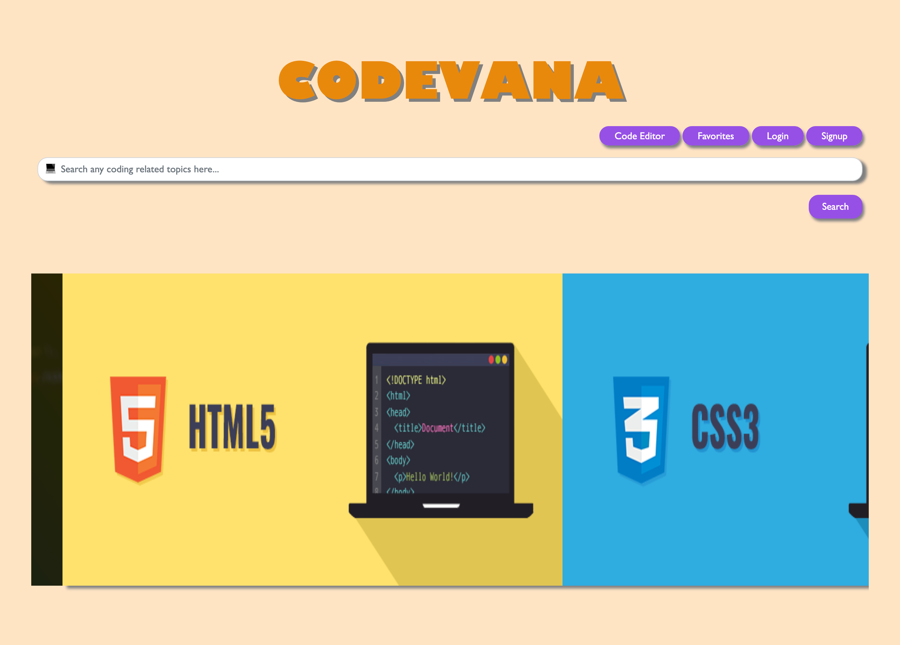

# Codevana

## Table of Contents
* <a href="#about">Link</a>
* <a href="#about">About</a>
* <a href="#preview">Preview</a>
* <a href="#user-story">User Story</a>
* <a href="#technologies">Technologies</a>
* <a href="#made-by-codewizards">Creator</a>

## Link
<b> Link to site: </b> https://codevana.herokuapp.com/

## About
<b>Codevana</b> is a website that allows users to search through multiple databases of coding websites to have an all in one 3rd party application and lets them store their favorite programming related pages.

## Preview

## User Story

AS A programmer 
I WANT to easily access different programming resources on one website 
SO THAT I can be more proficient and I don’t have to waste any time researching

## Technologies
* HTML
* CSS
* Javascript
* Node.js
* Express.js
* Axios 
* SQL
* Sequelize

## Made by CodeWizards

Navleen, Stephen, Hashim
